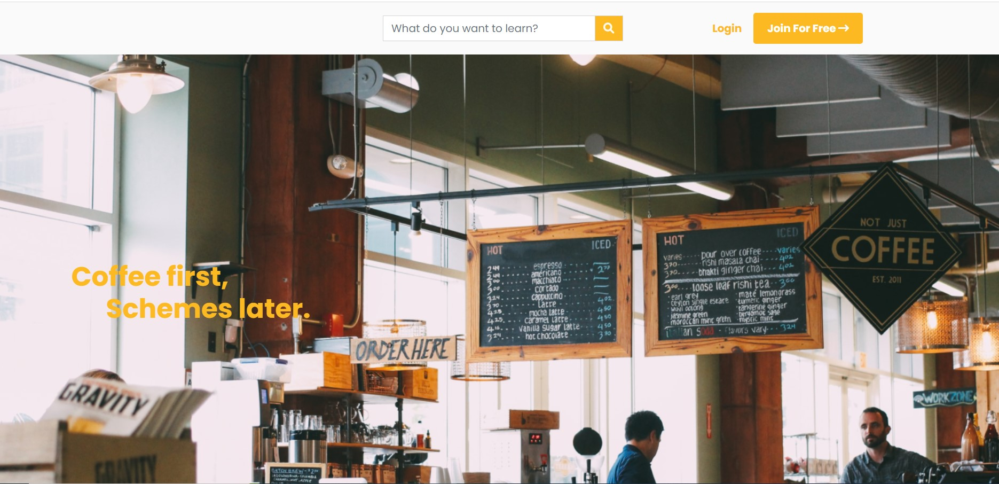
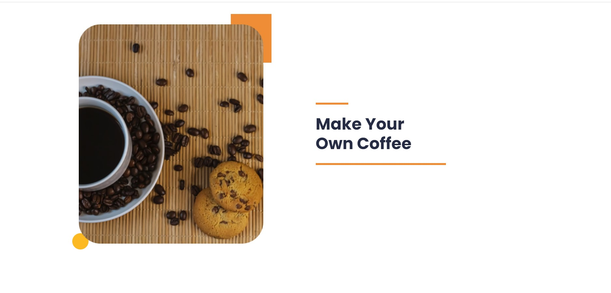
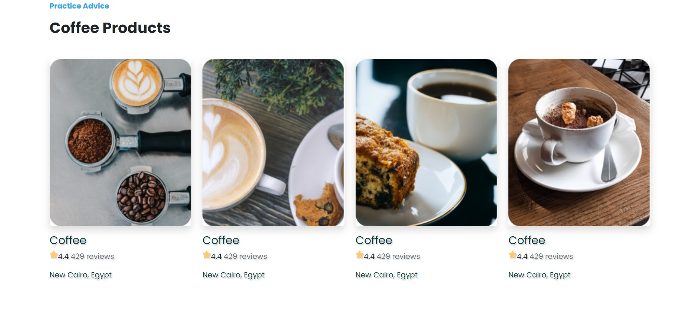

# Internship-2022-Task-Delivery

## Features

- HTML (https://www.w3schools.com/html/)
- CSS(https://www.w3schools.com/css/)
- Bootstrap 5 (https://getbootstrap.com/docs/5.0/getting-started/introduction/)
- Font Awesome 6 (https://fontawesome.com/icons)
- JavaScript (https://www.w3schools.com/js/)

## Explaining the project 

This is a website template for coffee shop implemented using Html , css, vanilla javascript and bootstrap ,
This website has 3 sections , header in top with navigation bar  and footer at the bottom content subscriber form .

well beginning with the land page  it simply  page continue background with some text in it.

Followed by the "about"section that basically a container with 2 item the first one a picture and second paragraph continue some text with css styles.

Then we have the gallery that has some  images of coffee  and the bottom of every image you can find description i used Grid system in bootstrap to designed it.

Lastly we have a Footer continue a Subscription Forms.

Description Web application is based on CSS,HTML,JavaScript,Bootstrap framework.
 and this website is a fully responsive website so you can use in the mobile version of this website

## Requirements:

I wrote my code on visual studio code and used github pages to make a web link so that anyone can access it.

### Project Demo

https://template-coffee-shop.netlify.app/
## ScreenShots
-  Homepage 

| Homepage |
| :---: | 
|  

- Products  and About page

| About  | Products page |
| :---: | :---: |
|   | |

- Responsive show case

| Responsive Web | Responsive Web |
| :---: | :---: | 
|  | 

## How to use it
- First of go to demo and see the Magic happen!
